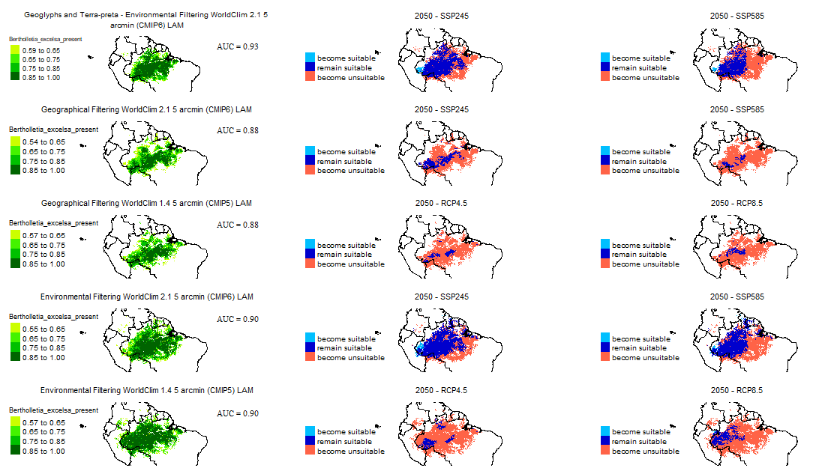

# Introdução

## Título

---

\begin{center}
  {\textbf {Impacto das mudanças climáticas na distribuição da \emph{Bertholletia excelsa}}}
\end{center}

```{r echo=FALSE, fig.align='center', out.width='30%'}

```  

\scriptsize Gabriel de Freitas Pereira - Graduando de Engenharia Florestal \  


\scriptsize Karina Martins - Orientadora, Departamento de Biologia, Centro de Ciências Humana e Biológicas, UFSCar


## Espécie

---

\begin{emph}
  {\emph {Bertholletia excelsa}}
\end{emph}

```{r echo=FALSE, fig.align='center', out.width='90%'}
knitr::include_graphics("slide_images/imgs_sementes_ourico.PNG")
```

\center {\scriptsize {\color{blue}Figura 1}: fotos Karina Martins (1 a 3) e Renata Silva (4)} 


## Situação da Espécie

--- 

\center “Trata-se de uma espécie protegida pela Instrução Normativa IBDF n° 001/80 e consta na lista de espécies ameaçadas de extinção do Código Florestal (Lei Federal no 4771).”

\center {\scriptsize {\color{blue}Fonte}: Embrapa}

\  


\center {\scriptsize {\color{blue}Figura 2}: fonte https://www.iucnredlist.org}


---

\begin{center} 
  Projeto {\textbf {EcoGenCast}}
\end{center}

\center 

Ecologia e genética da castanheira (\emph {Bertholletia excelsa} Bonpl.) como subsídio a conservação e uso sustentável da espécie

2016 – atualmente 

```{r echo=FALSE, fig.align='center', out.width='40%'}

```

\center {\scriptsize {\color{blue}Figura 3}: fonte https://www.embrapa.br/}

# Materiais e Métodos

## Objetivo 

### Objetivos

\center

- Criar um mapa preciso para determinar adequabilidade da espécie;

- Avaliar como os humanos influenciam a disseminação das sementes de castanheira e seu desenvolvimento;

- Prever como as mudanças climáticas afetarão a capacidade de crescimento no futuro e identificar áreas que precisam ser conservadas.


## Pontos de Ocorrência da Espécie

--- 

```{r echo=FALSE, out.width='83%', fig.align='center'}

```

\center {\scriptsize {\color{blue}Figura 4}: Tourne et al. 2019. \textbf {Ecology and Evolution}.}

---

```{r echo=FALSE, out.width='70%', fig.align='center'}
knitr::include_graphics("slide_images/pres_pts_collaborators.PNG")
```

\center {\scriptsize {\color{blue}Figura 5}: Registros de ocorrência reunidos da castanheira.}

---

\begin{itemize} \itemsep7pt


\item Tipos de resoluções testadas:
        
        - 2.5 arcmin. (usada em todos os modelos)
        
        - 5 arcmin. (descartada no primeiro modelo)
        
        - 10 arcmin. (descartada no primeiro modelo)

\item Tipos de filtragens testadas:
        
        - Geográfica
        
        - Geográfica + Ambiental 

\end{itemize}

## Modelagem

---

### Modelo de Distribuição da Espécie (SDM)

\begin{itemize} \itemsep7pt


  \item Variações:
        
        - Pan-Amazônia / Amazônia brasileira
        
        - Registros de geoglifos e terra-preta 
        
        - 2 cenários futuros
        
  \item Combinação de 10 algoritmos, pacote BiodiversityR: 
  
        MAXENT, RF, GBM, GLMSTEP, GLMNET, GAMSTEP, MGCV, FDA, SVM e EARTH
        
  \item Validação cruzada espacial por blocos:
      
        pacote blockCV


\end{itemize}

--- 


```{r echo=FALSE, out.width='100%', fig.align='center'}
# library( nomnoml )
# nomnoml( 
# "[<frame>tipos de pontos usados:|
#   [<abstract>pseudo-ausência]
#   [Presença] --> [pseudo-ausência]
#   [grupo-alvo]
#   [pseudo-ausência] <:- [grupo-alvo]
#   [pseudo-ausência] <:- [altitude]
# ]"
# )


```

\center {\scriptsize {\color{blue}Figura 6}: Tipos de pontos considerados nos modelos.}

### Variáveis 


```{r echo=FALSE, out.width='75%', fig.align='center'}

```

\center {\scriptsize {\color{blue}Figura 7}: Variáveis Tourne et al., 2019.}

---

```{r echo=FALSE, out.width='52%', fig.align='center'}

```

\center {\scriptsize {\color{blue}Figura 8}: Variáveis VIF.}


# Resultados e Discussão

## Usando Variáveis Tourne et al. 2019

---

AUC = 0.87

```{r echo=FALSE, out.width='75%', fig.align='center'}

```


\center {\scriptsize {\color{blue}Figura 9}: Probabilidade de ocorrência da \emph{Bertholletia excelsa} numa escala de 0 a 1000 adequadas para a modelagem à resolução 2.5 arco minutos usando a filtragem geográfica.}


## Melhor Modelo Encontrado

---

AUC = 0.94

```{r echo=FALSE, out.width='100%', fig.align='center'}

```

\center {\scriptsize {\color{blue}Figura 10}: Modelo usando filtragem geográfica + ambiental à resolução 2.5 arco minutos, e suas projeções futuras nos cenários SSP245 e SSP585 para o período médio de 2050.}

---

```{r echo=FALSE, out.width='80%', fig.align='center'}

```

\center {\scriptsize {\color{blue}Figura 11}: Variáveis que mais impactaram o melhor modelo.}


## Outros modelos usando Variáveis VIF

---

```{r echo=FALSE, out.width='100%'}
knitr::include_graphics("maps_table_img.png")
```

\center {\scriptsize {\color{blue}Figura 12}: Resultados dos Modelos.}


---

```{r echo=FALSE, out.width='100%'}

```

\center {\scriptsize {\color{blue}Figura 13}: Resultados dos Modelos.}

---

[ link com todos os resultados \color{blue}https://gabrielforest.github.io/maps_grid/](https://gabrielforest.github.io/maps_grid/)

```{r echo=FALSE, out.width='100%'}
knitr::include_graphics("slide_images/print_painel.png")
```
\center {\scriptsize {\color{blue}Figura 14}: Dashboard com todos os resultados.}


# Agradecimentos

---

```{r echo=FALSE, out.width='83%', fig.align='center'}
knitr::include_graphics("slide_images/co_authors.PNG")
```


