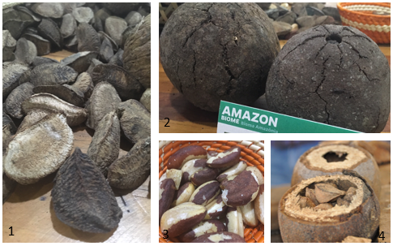
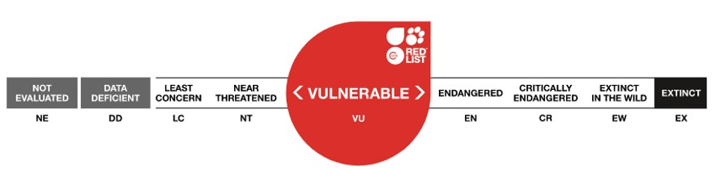
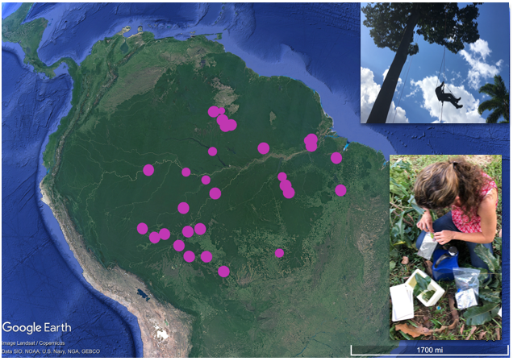
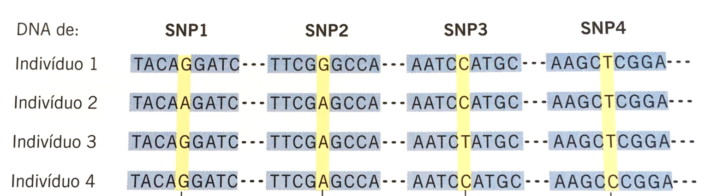
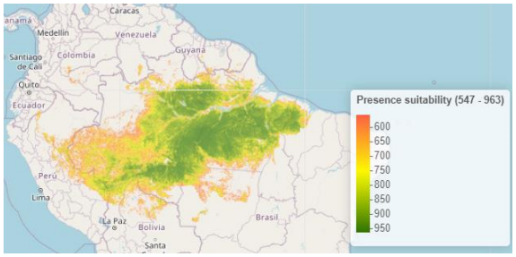
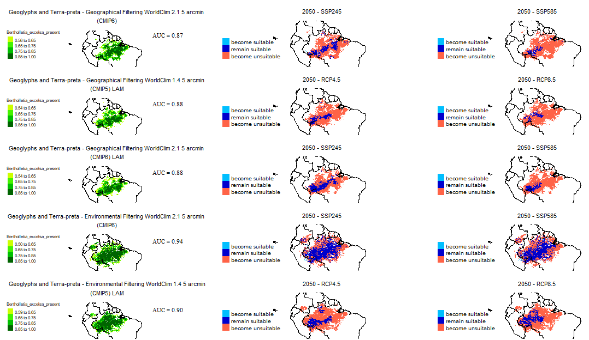
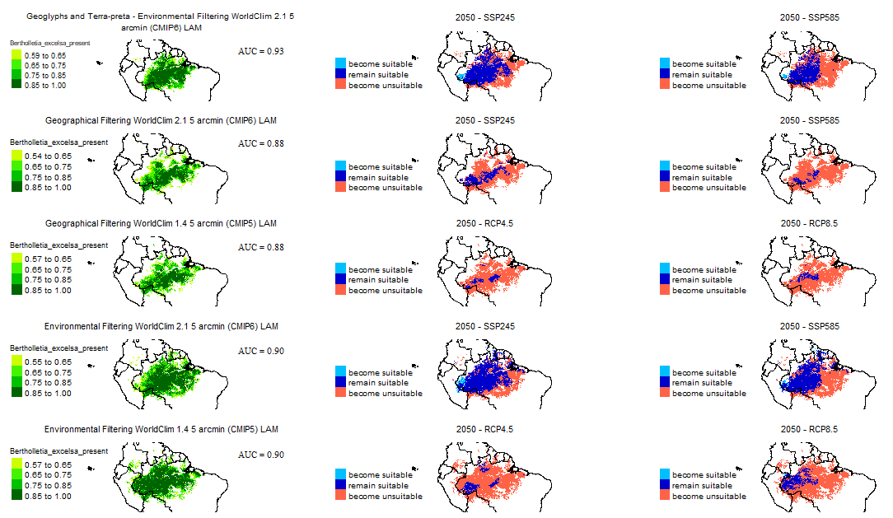
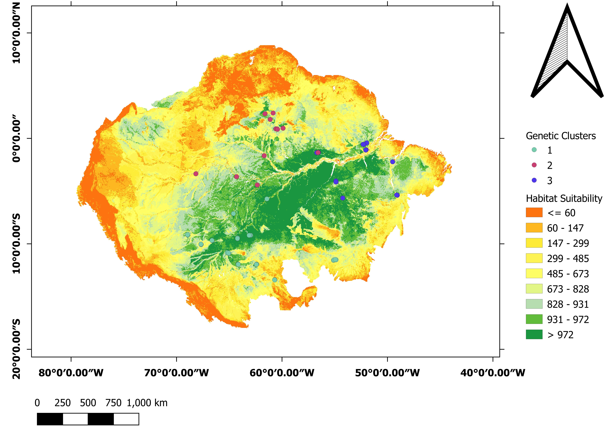
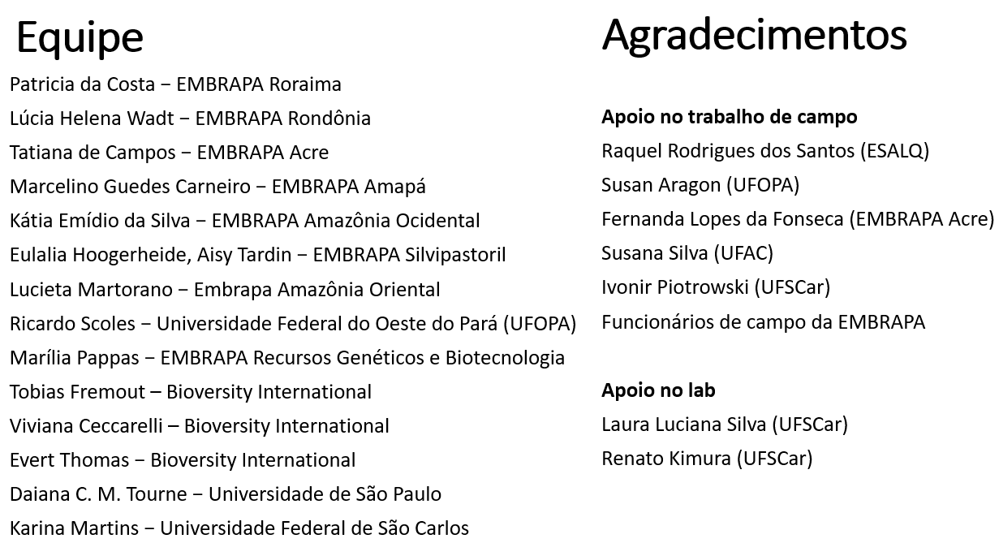

# Introdução

## Título

---

\begin{center}
  {\textbf {Definição de áreas prioritárias para conservação da castanheira com base na distribuição espacial genômica.}}
\end{center}

\  

\scriptsize Gabriel de Freitas Pereira - Graduando de Engenharia Florestal \  


\scriptsize Karina Martins - Orientadora, Departamento de Biologia, Centro de Ciências Humana e Biológicas, UFSCar


## Espécie

---

\begin{emph}
  {\emph {Bertholletia excelsa}}
\end{emph}

```{r echo=FALSE, fig.align='center', out.width='90%'}

```

\center {\scriptsize {\color{blue}Fotos}: Karina Martins (1 a 3) e Renata Silva (4)} 


## Situação da Espécie

--- 

\center “Trata-se de uma espécie protegida pela Instrução Normativa IBDF n° 001/80 e consta na lista de espécies ameaçadas de extinção do Código Florestal (Lei Federal no 4771).”

\center {\scriptsize {\color{blue}Fonte}: Embrapa}

\  



\center {\scriptsize {\color{blue}Fonte}: https://www.iucnredlist.org}


---

\begin{center} 
  Projeto {\textbf {EcoGenCast}}
\end{center}

\center 

Ecologia e genética da castanheira (\emph {Bertholletia excelsa} Bonpl.) como subsídio a conservação e uso sustentável da espécie

2016 – atualmente 


# Materiais e Métodos

## Objetivo 

### Objetivo Geral

\center

Definir as áreas prioritárias para a conservação da \emph {Bertholletia excelsa} Bonpl. ao longo do Brasil utilizando marcadores genéticos de elevada cobertura genômica.


## Amostragem

--- 

### Pontos de Coleta

\center Amostras Analisadas Geneticamente




## Marcador Genético

--- 

### SNPs

Mas o que são esses SNPs? 



## Modelagem

---

### Modelo de Distribuição da Espécie (SDM)

\begin{itemize} \itemsep7pt

  \item O que são os modelos de nicho ecológico? 

  \item Qual sua utilidade?

\end{itemize}


---

```{r echo=FALSE, out.width='83%', fig.align='center'}
knitr::include_graphics("slide_images/daiana_.PNG")
```

\center {\scriptsize {\color{blue}Fonte:} Tourne et al. 2019. \textbf {Ecology and Evolution}}


---

### Métrica Estatística

\begin{itemize} \itemsep7pt

  \item Mas o que seria a AUC?

  \item AUC = área abaixo da curva
  
\end{itemize}

---


\begin{itemize} \itemsep7pt

  \item Atualização dos pontos de localização da espécie 


  \item Tipos de filtragens usadas:
  
  \begin{itemize} 
  
    \item Geográfica
    \item Geográfica + Ambiental 
    
  \end{itemize}
  

\end{itemize}


# Resultados

## Usando Variáveis Tourne et al. 2019

---

```{r echo=FALSE, out.width='85%', fig.align='center'}

```

\center {\scriptsize {\color{blue}Figura 1.:} Probabilidade de ocorrência da Bertholletia excelsa numa escala de 0 a 1000 adequadas para a modelagem a 2.5 arco minutos usando a filtragem geográfica.}


## Usando Variáveis VIF

---

```{r echo=FALSE, out.width='100%'}

```

\center {\scriptsize {\color{blue}Figura 2}: Resultados dos Modelos}


---

```{r echo=FALSE, out.width='100%'}

```

\center {\scriptsize {\color{blue}Figura 3}: Resultados dos Modelos}


## Combinando Dados Genéticos

---

```{r echo=FALSE, out.width='90%', fig.align='center'}

```

\center {\scriptsize {\color{blue}Figura 4}: Grupos Genéticos}


# Agradecimentos

---

```{r echo=FALSE, out.width='100%'}

```


